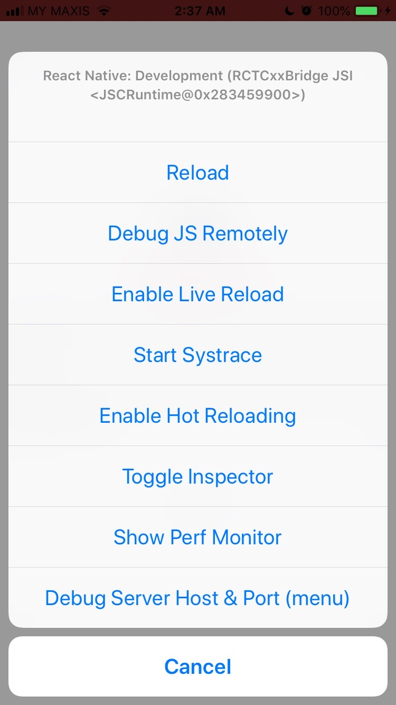
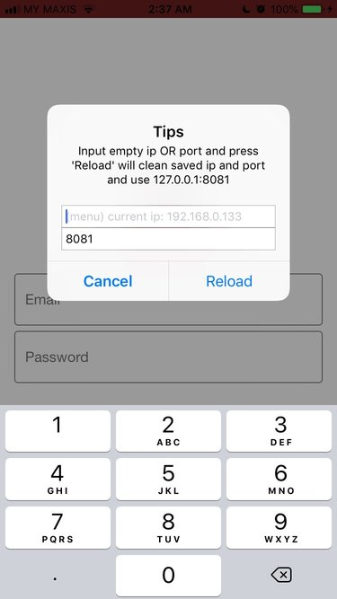

# react-native-ios-debug-bridge

> Debug server host and port for React Native iOS

## Installation

Firstly, install the package:

```
npm install --save react-native-ios-debug-bridge
```

Then, link the dependencies:

```
react-native link react-native-ios-debug-bridge
```

You should see something like this added to your `Podfile`:

```
pod 'SCDebugBridge', :path => '../node_modules/react-native-ios-debug-bridge'
```

Now, you just need to run:

```
pod install
```

Finally, update your `AppDelegate.m` so it looks something like this:

```objc
#import "SCDebugBridge.h"

@implementation AppDelegate

- (BOOL)application:(UIApplication *)application didFinishLaunchingWithOptions:(NSDictionary *)launchOptions
{
  RCTBridge *bridge = [[RCTBridge alloc] initWithDelegate:self launchOptions:launchOptions];
  RCTRootView *rootView = [[RCTRootView alloc] initWithBridge:bridge moduleName:@"Example App" initialProperties:nil];
  self.window = [[UIWindow alloc] initWithFrame:[UIScreen mainScreen].bounds];
  UIViewController *rootViewController = [UIViewController new];
  rootViewController.view = rootView;
  [SCDebugBridge setRootBridge:rootView.bridge];
  self.window.rootViewController = rootViewController;
  [self.window makeKeyAndVisible];
  return YES;
}

- (NSURL *)sourceURLForBridge:(RCTBridge *)bridge
{
#if DEBUG
  NSDictionary *ipAndPort = [SCDebugBridge getIpAndPort];
  return [NSURL URLWithString:[NSString stringWithFormat:@"http://%@:%@/index.bundle?platform=ios&dev=true&minify=false", ipAndPort[@"ip"], ipAndPort[@"port"]]];
#else
  return [CodePush bundleURL];
#endif
}

@end
```

## Usage

1. Shake the device, or use `Command + D` if it's a simulator, to launch
the menu.

2. Click on `Debug Server Host & Port` to spawn the dialog.

3. Enter the IP address.

4. Click `Reload`.




## Acknowledgement

The original source code is from the [Aevit/SCRNDemo][scrn-demo]
repository. I just modified it to make it easier to install as a
package.

[scrn-demo]: https://github.com/Aevit/SCRNDemo
